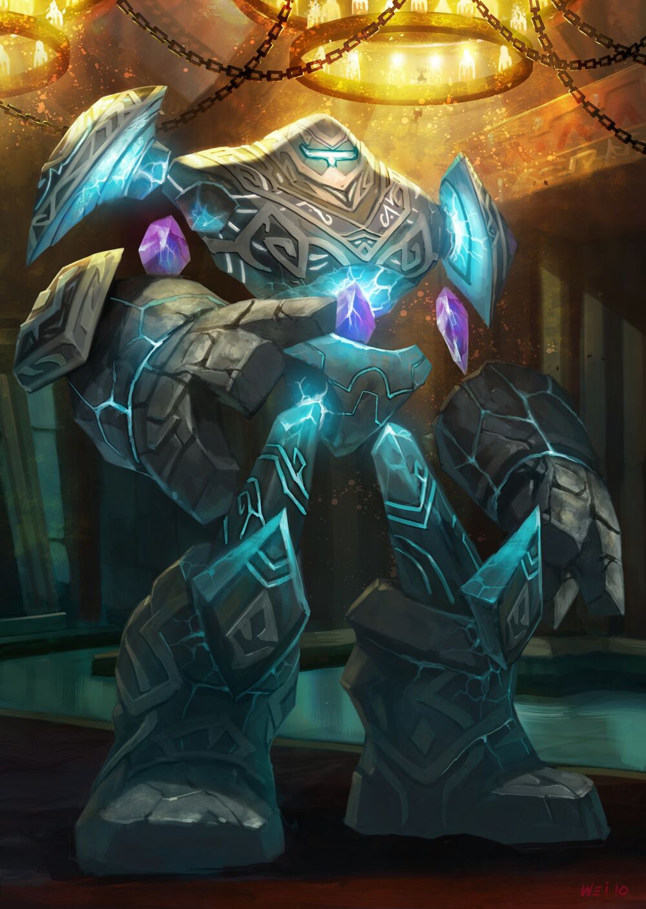

The Curator is the home-brew management bot for the Honor and Valor World of Warcraft Guild Discord Server.

- [Features](#features)
  - [Choose](#choose)
  - [Counting](#counting)
- [Installing The Curator](#installing-the-curator)
- [License](#license)
- [Contributing](#contributing)

# Features
Features may be enabled by sending this message in any channel:
> @The Curator enable [Feature Name]

Conversely, features may be disabled by sending this message in any channel:
> @The Curator disable [Feature Name]

Features that are channel-specific should be enabled from within the appropriate channel.

## Choose
Choose is a magic eight ball like command by which you may give The Curator a number of options among which for it to randomly select one.
For example:
> @The Curator choose boxers briefs

The Curator will randomly select one of the items listed and reply to your message with the one selected.
If you wish to include whitespace in an item, wrap it in quotation marks:
> @The Curator choose "The Departed" "Full Metal Jacket"

You must provide at least one item or the command will be rejected.

Choose is enabled by default, cannot be disabled, and is not channel-specific.

## Counting
Counting is a game by which users can enter successively higher numbers.
The game always begins with the number **1**.
Each message must be the next highest integer.
No user may enter a number twice in a row.

The first user to break the above rules loses the game and it starts over.
The Curator will:
- ignore messages that are not numeric;
- emoji respond with ✅ to acknowledge receipt of a valid number;
- reply to the losing message with the notification that the game was lost

Counting is disabled by default and is channel-specific.

# Installing The Curator
The Curator is built using Visual Studio 2022 / .NET 6.
Clone this repository and then, with the aforementioned tools installed, run the `TheCurator.ConsoleApp/Build.ps1` Powershell script.
The resulting publishing output will be in `TheCurator.ConsoleApp\bin\Release\net6.0\win-x64\publish`.
Copy this output to the Windows machine that will host The Curator.

Then, go to the [Discord Developer Portal](https://discord.com/developers/applications) and create a new bot.
Once you have invited it to your server, copy the token from the Bot page into a text file called `discordToken.txt` and place that in the same directory as the executible.
If you want The Curator to run automatically on the Windows host machine all the time (recommended), install it as a Windows Service by running this command in an elevated Command Prompt:
> sc create "The Curator" binpath= [Full Path to TheCurator.ConsoleApp.exe]

Use the Services MMC snap-in to start The Curator.
If the service won't start, check the Windows Event Log for details.

# License

[Apache 2.0 License](LICENSE)

# Contributing

[Click here](CONTRIBUTING.md) to learn how to contribute.